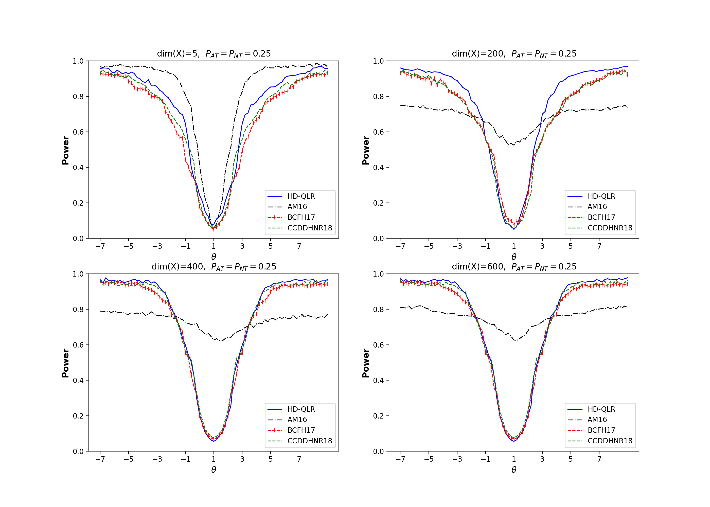
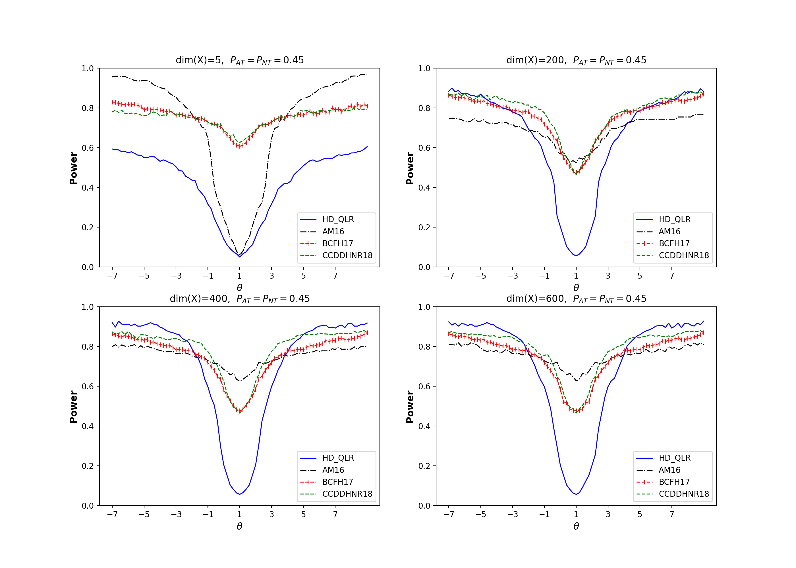

## Identification-robust inference for the LATE with high-dimensional covariates

**Abstract**: This paper investigates the local average treatment effect (LATE) with high-dimensional covariates, irrespective of the strength of identification. We propose a novel test statistic for the high-dimensional LATE and demonstrate that our test has uniformly correct asymptotic size. By employing the double/debiased machine learning method for nuisance parameter estimation, we develop easy-to-implement algorithms for inference and confidence interval calculation of the high-dimensional LATE. Simulations indicate that our test is robust against both weak identification and high dimensionality concerning size control and power performance, outperforming other conventional tests. Applying the proposed method to railroad and population data to study the effect of railroad access on urban population growth, we observe that our methodology yields point estimates for the railroad access coefficients that are smaller in magnitude, and confidence intervals that are by 49% to 92% shorter depending on specifications, when compared to the conventional results.

Read full article:

- [on Arxiv](https://arxiv.org/pdf/2302.09756.pdf)

**Presentations**: NY Camp Econometrics XVII, Chinese Economist Society North American Conference, 1st CIREQ Interdisciplinary PhD Student Conference on Big Data and Artificial Intelligence, 2023 Asia Meeting of the Econometric Society.

- [Slides](/assets/pdf/Yukun-Ma-JMP-AMES2023.pdf)

  
_Power curves for my proposed method (HD-QLR), the conventional identification-robust method (AM16), and conventional machine learning methods (CCDDHNR18 and BCFH17) are illustrated in the context of a **strongly** identified LATE design, with the proportion of compliers set at **0.5**._

_Power curves for my proposed method (HD-QLR), the conventional identification-robust method (AM16), and conventional machine learning methods (CCDDHNR18 and BCFH17) are illustrated in the context of a **weakly** identified LATE design, with the proportion of compliers set at **0.1**._
