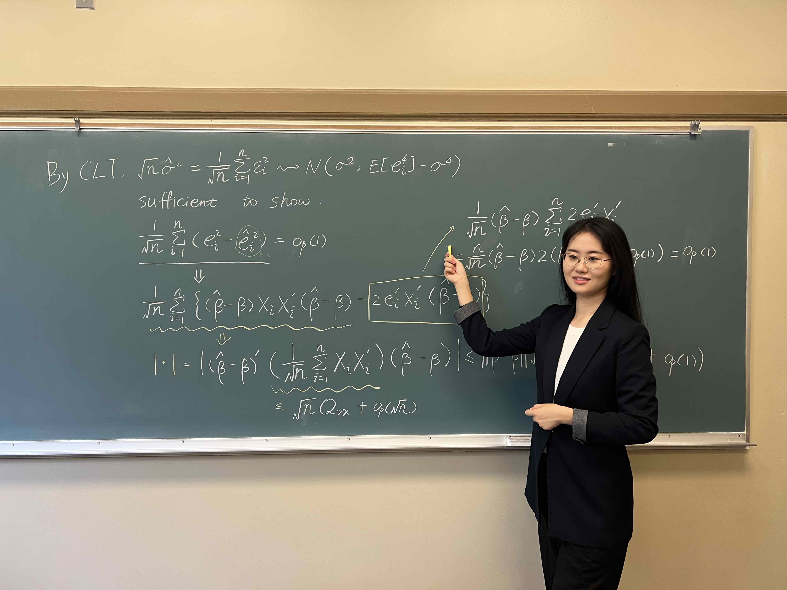

## _My Preferred Courses for Teaching_

- Econometrics for Big Data
- Machine Learning Techniques in Econometrics
- Econometrics
- Statistical Analysis

## _List of my TA experience_

### **Vanderbilt University**

#### Doctoral Courses

- Statistical Analysis: Fall 2020 (4.88/5)
- Microeconometrics: Spring 2023 (5/5)
- Econometrics I: Spring 2020 (5/5)

#### Master Courses

- Statistical Analysis: Fall 2020 (4.67/5)

#### Undergraduate Courses

- Economic Statistics: Fall 2019 (4.33/5)
- Principles of Microeconomics: Spring 2020 (4.67/5), Fall 2022 (4.50/5)
- Economic Statistics; Fall 2021, Spring 2022 (5/5), Spring 2023
- Econometric Methods: Fall 2021 (4.74/5), Spring 2021 (4.86/5)

### **Peking University**

- Optimization in Economics and Finance (Ph.D. level ) Spring 2017
- Macroeconomics & Policy Analysis (MBA course ) Spring 2017
